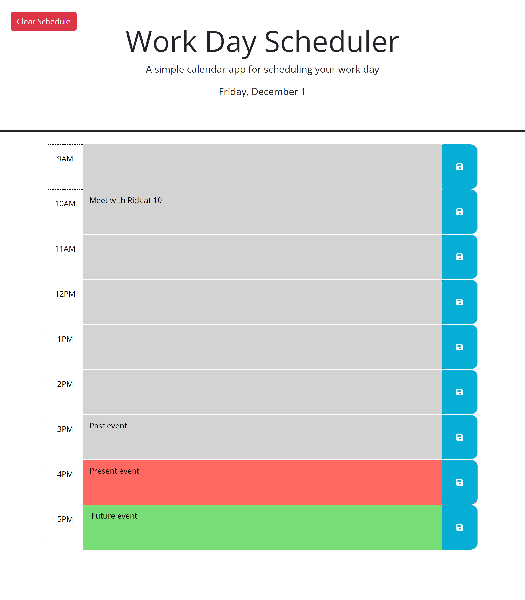

# 📅 Daily Planner App

Welcome to the Daily Planner App! Keep track of your daily schedule, set reminders, and enjoy a few surprises along the way.

## 🚀 Getting Started

1. Clone the repository: `git clone https://github.com/your-username/daily-planner.git`
2. Open `index.html` in your web browser.

## 📝 Features

- **Time Blocks:** Plan your day with time-blocked sections.
- **Save Button:** Easily save your schedule with a click.
- **Color Coding:** Time blocks change color based on past, present, or future.
- **Clear Schedule:** Quickly clear your entire schedule.

## 🎉 Fun Feature

Discover a hidden feature by entering a specific keyword in your schedule! 🕵️‍♂️

## 📷 Screenshots

## 🌐 Live Demo

Check out the live demo [here](https://index-al.github.io/Event-Planner/).

## 📅 Release History

- Version 1.0.0 (December 2023)

## 📄 License

This project is licensed under the MIT License - see the [LICENSE](LICENSE) file for details.

## 📧 Contact

Have questions or suggestions? Reach out to me at [DanTCathey@gmail.com](mailto:DanTCathey@gmail.com).

Enjoy planning your day! 🌟
